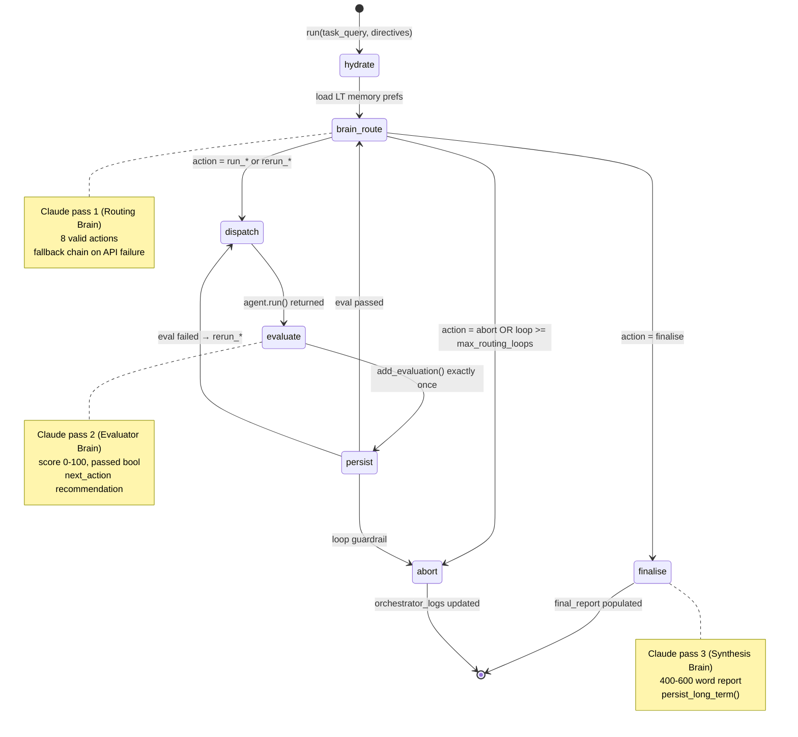
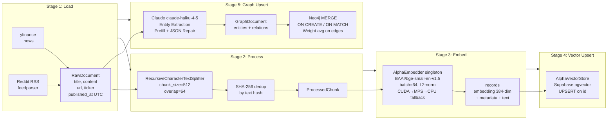

# AgenticAlpha — System Architecture

> **Document type:** Principal Architecture Reference  
> **Scope:** Full-stack read-only audit of the `D:/AgenticAlpha` repository  
> **Generated:** 2026-06-28  
> **Model graph:** 1,904 nodes · 8,436 edges (post-reindex)

---

## Table of Contents

1. [System Overview](#1-system-overview)
2. [Visual System Architecture](#2-visual-system-architecture)
3. [Core Component Breakdown](#3-core-component-breakdown)
   - 3.1 [API Layer](#31-api-layer)
   - 3.2 [ManagerAgent — Central Orchestrator](#32-manageragent--central-orchestrator)
   - 3.3 [ResearchAgent](#33-researchagent)
   - 3.4 [FinancialAnalystAgent](#34-financialanalystagent)
   - 3.5 [SentimentAgent](#35-sentimentagent)
   - 3.6 [MCP Tool Servers](#36-mcp-tool-servers)
   - 3.7 [Ingestion & ETL Pipeline](#37-ingestion--etl-pipeline)
   - 3.8 [Knowledge Graph Store (graph_store.py)](#38-knowledge-graph-store-rag-graph-storepy)
   - 3.9 [Hybrid RAG Engine](#39-hybrid-rag-engine)
   - 3.10 [Memory Architecture](#310-memory-architecture)
   - 3.11 [Observability](#311-observability)
4. [State Contract Design](#4-state-contract-design)
5. [Data & Execution Flow (Step-by-Step)](#5-data--execution-flow-step-by-step)
6. [Fallback & Resilience Mechanisms](#6-fallback--resilience-mechanisms)
7. [File & Directory Map](#7-file--directory-map)
8. [Environment Variables Reference](#8-environment-variables-reference)
9. [Known Limitations & Risk Factors](#9-known-limitations--risk-factors)

---

## 1. System Overview

**AgenticAlpha** is a production-grade, multi-agent financial intelligence platform. Given a natural-language query such as *"Is NVIDIA a good buy for Q1 2025?"*, it orchestrates a coordinated swarm of specialist AI agents to produce a structured investment analysis report combining live market data, SEC regulatory filings, and real-time social/news sentiment.

The system is designed around three architectural principles:

| Principle | Implementation |
|-----------|----------------|
| **Separation of concerns** | Each specialist agent owns exactly one `SharedManagerState` field |
| **Graceful degradation** | Every external dependency (Neo4j, Supabase, Sentry, SEC EDGAR) has an isolated fallback path |
| **Cognitive memory** | Two-level memory (short-term session + long-term Supabase-backed) enables cross-session learning |

### Technology Stack

| Layer | Technology | Version / Model |
|-------|------------|-----------------|
| Language | Python | 3.11+ (async/await throughout) |
| Web framework | FastAPI + Uvicorn | Pydantic v2 validation |
| LLM provider | Anthropic Claude | `claude-haiku-4-5` (default) |
| Agent orchestration | LangGraph | `StateGraph` compiled graphs |
| Tool protocol | MCP (Model Context Protocol) | stdio JSON-RPC transport |
| Vector database | Supabase pgvector | `alpha_hybrid_search` RPC |
| Knowledge graph | Neo4j | AuraDB / self-hosted, Bolt protocol |
| Embedding model | BAAI/bge-small-en-v1.5 | 384-dim, L2-normalised, sentence-transformers |
| Sentiment — deep NLP | ProsusAI/finbert | HuggingFace Transformers |
| Sentiment — lexical | NLTK VADER | Rule-based compound scorer |
| Financial data | Yahoo Finance (yfinance) | REST / unofficial API |
| Regulatory filings | SEC EDGAR | XBRL API + full-text search |
| News search | Tavily API + NewsAPI | HTTP REST |
| Persistence | Supabase PostgreSQL | `analyses`, `long_term_memory` tables |
| Error tracking | Sentry SDK | Optional; SENTRY_DSN env var |
| LLM tracing | LangSmith | Optional; LANGSMITH_API_KEY env var |
| CI/CD | GitHub Actions | deploy.yml + daily_refresh.yml |

---

## 2. Visual System Architecture

### 2.1 Top-Down System Flowchart

```mermaid
flowchart TD
    subgraph INGESTION["🔄 Ingestion Pipeline (rag/ingestion.py)"]
        direction TB
        SRC1[yfinance News] --> LOADER[AlphaLoader]
        SRC2[Reddit RSS] --> LOADER
        LOADER --> PROC[AlphaProcessor\nChunk + Deduplicate]
        PROC --> EMBED[AlphaEmbedder\nBAAI/bge-small-en-v1.5\n384-dim L2-norm]
        EMBED --> VS[(Supabase pgvector\nalpha_hybrid_search RPC)]
        PROC --> GS_EXTRACT[Claude claude-haiku-4-5\nEntity + Relation Extraction\nJSON Prefill Mechanic]
        GS_EXTRACT --> NEO4J[(Neo4j\nMERGE Idempotent\nNodes + Edges)]
    end

    subgraph API["🌐 API Layer (api/)"]
        CLIENT[Client\nPOST /api/v1/analyze] --> ROUTE[analyze.py\nPydantic Validation]
        ROUTE --> DI[Depends: get_manager_memory\nPer-request ManagerMemory]
    end

    subgraph ORCHESTRATOR["🧠 ManagerAgent LangGraph (agents/manager_agent.py)"]
        direction TB
        HYDRATE[hydrate\nInit SharedManagerState\nApply LT Memory Prefs] --> BRAIN_ROUTE[brain_route\nClaude: Routing Decision\nSTATEFUL 8-loop guardrail]
        BRAIN_ROUTE -->|run_* / rerun_*| DISPATCH[dispatch\nSpecialist Agent Execution]
        DISPATCH --> EVALUATE[evaluate\nClaude: Quality Verdict\nscore 0-100]
        EVALUATE --> PERSIST[persist\nManagerMemory Write\nHeuristics + Ticker Cache]
        PERSIST -->|passed| BRAIN_ROUTE
        PERSIST -->|failed| DISPATCH
        BRAIN_ROUTE -->|finalise| FINALISE[finalise\nClaude: Synthesis\nInvestment Report]
        BRAIN_ROUTE -->|abort| ABORT[abort\nGuardrail Exit]
        FINALISE --> SUPABASE_RESULT[(Supabase\nanalyses table)]
    end

    subgraph AGENTS["🤖 Specialist Agents"]
        direction LR
        subgraph RA["ResearchAgent (LangGraph)"]
            RA_BRAIN[brain\nClaude: Plan 1-3 tools] --> RA_EXEC[executor\nMCP Client calls]
            RA_EXEC --> RA_CHECK[checker\nClaude: Completeness Audit]
            RA_CHECK -->|incomplete| RA_BRAIN
        end
        subgraph FA["FinancialAnalystAgent"]
            FA_BRAIN[brain\nClaude: Plan iteration] --> FA_EXEC1[executor\nYahoo Finance\nSEC XBRL]
            FA_EXEC1 --> FA_EXEC2[executor\nRatio Calculator\nComposite Score]
            FA_EXEC2 --> FA_CHECK[checker\nClaude: 7-Criterion Audit]
            FA_CHECK -->|failed| FA_BRAIN
        end
        subgraph SA["SentimentAgent"]
            SA_BRAIN1[brain_plan\nClaude: RAG Query] --> SA_EXEC[executor\nretrieve→finbert\n→vader→fear_greed]
            SA_EXEC --> SA_BRAIN2[brain_analyze\nClaude: Narrative]
        end
    end

    subgraph MCP_SERVERS["⚙️ MCP Tool Servers (stdio JSON-RPC)"]
        RESEARCH_SRV["research_server.py\n8 tools:\ntavily_search\nnews_search\nsec_edgar_search\nsec_edgar_filing\nrag_vector_search\nrag_graph_traverse\nrag_hybrid_query\ncomprehensive_analysis"]
        FINANCIAL_SRV["financial_server.py (FastMCP)\n17 tools:\nYahoo Finance ×4\nSEC EDGAR ×4\nRatio Calc ×9"]
        SENTIMENT_SRV["sentiment_server.py\n4 tools:\nretrieve_social_data\nanalyze_finbert\nscore_vader\ncalculate_fear_greed"]
    end

    subgraph MEMORY["💾 Memory (memory/manager_memory.py)"]
        STM[ShortTermMemory\nLLM messages\nAgent log\nEval feedback]
        LTM[LongTermMemory\noperational_heuristics\nticker_insights\nuser_preferences]
        STM <--> LTM
        LTM <--> SUPABASE_MEM[(Supabase\nlong_term_memory table)]
    end

    subgraph OBS["🔭 Observability"]
        SENTRY[Sentry\nError tracking\nBreadcrumbs per tool call]
        LANGSMITH[LangSmith\n@traceable decorators\nFull LLM trace]
    end

    CLIENT --> ORCHESTRATOR
    DI --> MEMORY
    ORCHESTRATOR --> AGENTS
    RA_EXEC --> RESEARCH_SRV
    FA_EXEC1 --> FINANCIAL_SRV
    FA_EXEC2 --> FINANCIAL_SRV
    SA_EXEC --> SENTIMENT_SRV
    RESEARCH_SRV --> VS
    RESEARCH_SRV --> NEO4J
    SENTIMENT_SRV --> VS
    INGESTION -.->|pre-populate| VS
    INGESTION -.->|pre-populate| NEO4J
    ORCHESTRATOR --> MEMORY
    ORCHESTRATOR --> OBS
    AGENTS --> OBS
```

### 2.2 ManagerAgent LangGraph State Machine



### 2.3 RAG Pipeline



---

## 3. Core Component Breakdown

### 3.1 API Layer

**Files:** [api/main.py](api/main.py), [api/config.py](api/config.py), [api/routes/analyze.py](api/routes/analyze.py), [api/dependencies.py](api/dependencies.py), [api/core/exceptions.py](api/core/exceptions.py)

The FastAPI application follows a **lifespan-owned singleton** pattern: all expensive resources (Supabase client, compiled ManagerAgent, specialist agents) are instantiated once at startup and stored on `app.state`.

**Startup sequence (lifespan):**

```
1. validate_settings()        → fail-fast on missing env vars
2. init_sentry() + init_langsmith()
3. create_client(SUPABASE_URL, SUPABASE_KEY)
4. ResearchAgent(), FinancialAnalystAgent(), SentimentAgent()
5. ManagerMemory(user_id="system", supabase_client=...)
6. ManagerAgent(...) → _build_graph() → builder.compile()
```

**Request flow (POST /api/v1/analyze):**

```
AnalyzeRequest (Pydantic)
  → get_manager_memory() [Depends] → per-request ManagerMemory
  → ManagerAgent.run(task_query, manager_directives, user_preferences)
  → _persist_analysis() → Supabase analyses table (fire-and-forget)
  → AnalyzeResponse
```

**Error handling:** A hierarchical exception handler chain converts `AlphaAgentError` subclasses to structured JSON responses with `trace_id`, `error`, `message`, `detail`. Unhandled exceptions return 500 with no internal detail in production.

**CORS policy:** Wildcard `"*"` in development; explicit `ALLOWED_ORIGINS` list with `credentials=True` in production.

---

### 3.2 ManagerAgent — Central Orchestrator

**File:** [agents/manager_agent.py](agents/manager_agent.py)

The ManagerAgent is the top-level entry point for all analysis. It owns the `SharedManagerState` lifecycle and drives the specialist pipeline via a compiled LangGraph `StateGraph`.

**Graph topology (7 nodes, 2 conditional edges):**

```
START → hydrate → brain_route
                      │
        ┌─────────────┼──────────┐
        ▼             ▼          ▼
    dispatch      finalise    abort
        │              │          │
    evaluate          END        END
        │
    persist
        │
    ┌───┴──────────────┐
    ▼                  ▼
brain_route         dispatch
(eval passed)       (eval failed → rerun_*)
```

**Three Brain LLM passes (all use `anthropic.AsyncAnthropic`):**

| Pass | Node | Role | max_tokens |
|------|------|------|-----------|
| 1 | `brain_route` | Routing decision — one of 8 valid actions | 768 |
| 2 | `evaluate` | Quality verdict — score 0-100, passed bool | 768 |
| 3 | `finalise` | Report synthesis — 400-600 word plain text | 2048 |

**Routing actions vocabulary:**

| Action | Meaning |
|--------|---------|
| `run_research` | Dispatch ResearchAgent (first time) |
| `run_financial` | Dispatch FinancialAnalystAgent (first time) |
| `run_sentiment` | Dispatch SentimentAgent (first time) |
| `rerun_research` / `rerun_financial` / `rerun_sentiment` | Re-dispatch after evaluation failure |
| `finalise` | All agents complete — synthesise report |
| `abort` | Guardrail hit or unrecoverable error |

**Guardrail:** `max_routing_loops=8` (configurable via `MAX_ROUTING_LOOPS` env var). The recursion limit is set to `(max_routing_loops + 2) * 4` on `ainvoke`.

**Brain fallback on API failure:** If the Claude routing call fails, the ManagerAgent deterministically advances through `run_research → run_financial → run_sentiment → finalise`, preventing a pipeline stall.

---

### 3.3 ResearchAgent

**File:** [agents/research_agent.py](agents/research_agent.py)

A LangGraph `StateGraph` with 3 nodes (brain → executor → checker) and one conditional routing edge. Uses the synchronous `anthropic.Anthropic` client.

**Internal loop (max 3 iterations by default):**

```
brain_node      → Claude produces JSON action plan (1-3 tool calls)
executor_node   → Opens stdio MCP session to research_server.py
                  Executes each tool and collects context_chunks
checker_node    → Claude audits completeness:
                    - >= 1 source from last 30 days
                    - Factual depth (numbers, dates, entities)
                    - Multi-source coverage (>= 2 tool types)
                    - No hallucination risk
                  Returns { is_complete, score, missing, feedback }
```

**Available MCP tools (8):**

| Tool | Backend | Best For |
|------|---------|----------|
| `tavily_search` | Tavily API | Breaking news, macro events |
| `news_search` | NewsAPI | Recent press coverage |
| `sec_edgar_search` | EDGAR full-text | Filing metadata search |
| `sec_edgar_filing` | EDGAR filings | 10-K/10-Q section extraction |
| `rag_vector_search` | Supabase pgvector | Semantic similarity |
| `rag_graph_traverse` | Neo4j Cypher | Entity relationships |
| `rag_hybrid_query` | RRF fusion | Complex multi-faceted queries |
| `comprehensive_analysis` | Tavily + SEC | Combined news + filing in one call |

**Output contract:** Appends all collected `context_chunks` to `SharedManagerState["aggregated_research_context"]`.

---

### 3.4 FinancialAnalystAgent

**File:** [agents/financial_agent.py](agents/financial_agent.py)

A three-layered imperative loop (not LangGraph internally). Uses a long-lived stdio MCP session to `financial_server.py`.

**Three-layer architecture:**

```
LAYER 3 — Brain   : Claude plans iteration, advises priority_tools
LAYER 1a — Executor: tool_get_financial_ratios   → yahoo_ratios
LAYER 1b — Executor: tool_get_revenue_growth     → revenue_growth
LAYER 1c — Executor: tool_get_xbrl_financials    → xbrl_financials
LAYER 1d — Executor: tool_calc_{pe,roe,net_margin,de_ratio,cagr,composite_score}
LAYER 2 — Checker : Claude audits 7 quality criteria → is_complete bool
```

**7 Checker quality criteria (all must pass):**

1. DATA PRESENCE — Yahoo payload non-empty and error-free
2. REVENUE HISTORY — ≥ 2 years of annual revenue for CAGR
3. CORE RATIO COVERAGE — ≤ 1 of 5 core ratios may be null
4. VALUATION SANITY — P/E positive, below 1000, sector-plausible
5. COMPOSITE SCORE — Weighted 0-100 score computable
6. INTERNAL CONSISTENCY — Ratios mathematically consistent with raw data
7. MANAGER READINESS — Dataset sufficient for actionable conclusions

**Composite score weighting:**

| Metric | Weight |
|--------|--------|
| ROE | 25% |
| Net Margin | 20% |
| Revenue CAGR | 20% |
| P/E ratio (lower = better) | 15% |
| Current Ratio | 10% |
| D/E ratio (lower = better) | 10% |

**Ticker resolution priority:** `manager_directives["ticker"]` → regex scan of `task_query` → `None`

**Output contract:** Populates `SharedManagerState["financial_metrics_summary"]` with 20+ verified fields.

---

### 3.5 SentimentAgent

**File:** [agents/sentiment_agent.py](agents/sentiment_agent.py)

A two-tier Brain → Executor design (no separate Checker — the Brain's second pass performs semantic QA inline).

**Execution lifecycle:**

```
Brain Pass 1 (_brain_plan):
  Claude produces: { retrieval_query, ticker, days_back, reasoning }
  Uses financial context from FinancialAnalystAgent output as grounding

Executor (_execute_sentiment_pipeline):
  Step 1: retrieve_social_data → chunks + sources_metadata (via AlphaRetriever)
  Step 2: analyze_finbert      → bullish/bearish/neutral probabilities
  Step 3: score_vader          → compound [-1, +1], pos/neg/neu means
  Step 4: calculate_fear_greed → weighted fusion (FinBERT 65%, VADER 35%)
              score [-1, +1], label = Extreme Fear → Extreme Greed (5 bands)

Brain Pass 2 (_brain_analyze):
  Claude synthesises all signals:
  { overall_sentiment, conviction_level, key_signals, model_agreement,
    narrative, risk_flags, data_quality_note }
```

**Loop exit condition:** If zero chunks retrieved on iteration 1, retries once with a broader query (max_loops=2). Brain pass 2 always runs regardless.

**Fear/Greed weighting:** `FEAR_GREED_FINBERT_WEIGHT=0.65`, `FEAR_GREED_VADER_WEIGHT=0.35` (overridable via env vars or `manager_directives`).

**Ticker resolution priority:** `manager_directives["ticker"]` → `financial_metrics_summary["ticker"]` → regex scan of `task_query`

---

### 3.6 MCP Tool Servers

All three tool servers use the **stdio JSON-RPC transport** — they are launched as subprocesses by each agent using `StdioServerParameters(command="python", args=[path/to/server.py])`.

#### research_server.py

**File:** [tools/research_tools/research_server.py](tools/research_tools/research_server.py)  
Uses `mcp.server.Server` with `@app.list_tools()` + `@app.call_tool()` pattern. Routes via Python `match/case`.

#### financial_server.py (FastMCP)

**File:** [tools/financial_tools/financial_server.py](tools/financial_tools/financial_server.py)  
Uses `FastMCP` decorator-based API (`@mcp.tool()`). Exposes **17 tools** across 3 categories:

| Category | Tools |
|----------|-------|
| Yahoo Finance | `get_price_history`, `get_financial_ratios`, `get_revenue_growth`, `get_peer_comparison` |
| SEC EDGAR | `get_cik`, `list_filings`, `get_filing_text`, `get_xbrl_financials` |
| Ratio Calculator | `calc_pe`, `calc_pb`, `calc_ev_ebitda`, `calc_peg`, `calc_gross_margin`, `calc_operating_margin`, `calc_net_margin`, `calc_roe`, `calc_roa`, `calc_current_ratio`, `calc_quick_ratio`, `calc_debt_to_equity`, `calc_interest_coverage`, `calc_asset_turnover`, `calc_cagr`, `calc_revenue_cagr_from_growth`, `calc_composite_score` |

#### sentiment_server.py

**File:** [tools/sentiment_tools/sentiment_server.py](tools/sentiment_tools/sentiment_server.py)  
Exposes **4 tools**. Tool singletons are lazy-initialised (models loaded only on first call):
- `_get_retriever()` → `AlphaRetriever` backed by `AlphaVectorStore` + `AlphaEmbedder`
- `_get_finbert()` → `FinBertSentimentAnalyzer` (ProsusAI/finbert, HuggingFace)
- `_get_vader()` → `VaderLexiconScorer` (NLTK VADER)
- `_get_fear_greed()` → `FearGreedIndexCalculator`

All MCP tool calls in `call_tool()` run via `asyncio.to_thread()` because the underlying models and Supabase calls are synchronous.

---

### 3.7 Ingestion & ETL Pipeline

**File:** [rag/ingestion.py](rag/ingestion.py) — `run_ingestion_pipeline(tickers, skip_graph=False)`

The ETL pipeline is a 5-stage sequential process. Stage 5 only runs if Stage 3+4 succeeded (`vector_stage_ok=True`).

```
Stage 1 — Load (AlphaLoader)
    Sources: yfinance (.news property, max 20/ticker) + Reddit RSS (r/investing, r/wallstreetbets, max 30/feed)
    Circuit breakers: per-ticker and per-feed try/except — one broken source never blocks the rest
    Output: list[RawDocument(title, content, url, source_type, ticker, published_at:UTC-ISO8601)]

Stage 2 — Process (AlphaProcessor)
    RecursiveCharacterTextSplitter(chunk_size=512, overlap=64)
    SHA-256 deduplication on text content
    Output: list[ProcessedChunk]

Stage 3 — Embed (AlphaEmbedder singleton)
    Model: BAAI/bge-small-en-v1.5, 384-dim
    Device: CUDA → MPS (Apple Silicon) → CPU fallback
    Batch size: 64, L2-normalised output
    Output: list[{embedding: list[float], metadata: dict, text: str}]

Stage 4 — Vector Upsert (AlphaVectorStore)
    Supabase pgvector UPSERT keyed by chunk id
    Enables alpha_hybrid_search RPC (vector + FTS, RRF fusion)

Stage 5 — Graph Upsert (AlphaGraphStore)
    Input: original RawDocuments (not chunks — full text for entity extraction)
    Claude: entity + relation extraction (see §3.8)
    Neo4j: MERGE nodes + relationships (idempotent)
```

**Daily refresh:** Scheduled via `.github/workflows/daily_refresh.yml` which calls `scheduler/daily_refresh.py`.

---

### 3.8 Knowledge Graph Store (`rag/graph_store.py`)

**File:** [rag/graph_store.py](rag/graph_store.py) — `AlphaGraphStore`

This is the most technically nuanced component. It uses Claude to extract a structured knowledge graph from unstructured financial text and persists it to Neo4j with full idempotency.

#### Claude Extraction — Two Key Mechanics

**1. JSON Prefill Mechanic**

The assistant turn is prefilled with `"{"` to force the model into raw JSON output immediately:

```python
messages=[
    {"role": "user",      "content": _EXTRACTION_PROMPT.format(text=..., ticker=...)},
    {"role": "assistant", "content": "{"},   # ← prefill forces JSON output
]
raw = "{" + response.content[0].text        # ← prepend the "{" back
```

This eliminates markdown fences (`\`\`\`json ... \`\`\``), preambles ("Here is the JSON:"), and any post-response commentary. `temperature=0.0` ensures deterministic output.

**2. JSON Repair — Balanced Brace Parser (`_extract_json_block`)**

Rather than a simple `json.loads()`, a stateful brace-depth scanner handles:
- Markdown fences present despite prefill (defensive)
- Trailing commentary after the closing `}`
- Leading preamble before the opening `{`
- Braces appearing inside JSON string values (escaped correctly)

```
depth=0, in_str=False, escaped=False
for each char:
  if in_str:
    track \ escape sequences
    track " close
  else:
    track { (depth++) and } (depth--)
    when depth == 0: return raw[start:i+1]
```

#### Entity and Relation Schema

| Entity Types | Relation Types |
|-------------|----------------|
| `Company` | `COMPETES_WITH` |
| `Person` | `SUPPLIES_TO` |
| `GeopoliticalEvent` | `AFFECTED_BY` |
| `MacroEvent` | `LED_BY` |
| `Product` | `PART_OF` |
| `Sector` | `RELATED_TO` |
| | `ACQUIRED_BY` |

#### Neo4j Idempotency (MERGE semantics)

**Node upsert:**
```cypher
MERGE (e:{entity.type} {name: $name})
ON CREATE SET e.ticker = $ticker, e.description = $description, e.created_at = timestamp()
ON MATCH SET  e.ticker = CASE WHEN $ticker <> '' THEN $ticker ELSE e.ticker END,
              e.updated_at = timestamp()
```

**Edge upsert (with weight averaging):**
```cypher
MATCH (a {name: $source}), (b {name: $target})
MERGE (a)-[r:{rel_type}]->(b)
ON CREATE SET r.weight = $weight, r.evidence = $evidence, r.source_url = $source_url, r.created_at = timestamp()
ON MATCH SET  r.weight = ($weight + r.weight) / 2.0, r.updated_at = timestamp()
```

Re-running the ingestion pipeline on the same documents is safe — nodes are upserted by name, edges are upserted by `(source, target, type)`, and relationship weights converge via the running average.

**Uniqueness constraints** are created on first connect for all 6 entity types plus a ticker index on `Company`.

**Validation fallbacks:** Invalid entity types default to `"Company"`; invalid relation types default to `"RELATED_TO"`.

---

### 3.9 Hybrid RAG Engine

**Files:** [rag/hybrid_rag.py](rag/hybrid_rag.py), [rag/retriever.py](rag/retriever.py)

#### Three Query Modes (hybrid_rag.py)

| Function | Description |
|----------|-------------|
| `rag_vector_search(query, top_k, ticker_filter, days_back)` | Calls Supabase `alpha_hybrid_search` RPC (vector + FTS, RRF k=60). Returns scored chunks. |
| `rag_graph_traverse(entity, relation_types, max_hops, limit)` | Cypher variable-length path traversal `[*1..max_hops]`. max_hops hard-capped at 3 to prevent unreliable deep chains. |
| `rag_hybrid_query(query, entity, top_k, max_hops, fusion)` | Runs vector + graph in parallel (`asyncio.gather`). Fuses via RRF, weighted blend, or union. Gracefully degrades to vector-only if entity cannot be resolved. |

**RRF formula:** `score(item) = Σ 1 / (k + rank)` where k=60. Applied independently per result list, then merged by text hash key.

#### AlphaRetriever — 5-Stage Pipeline (retriever.py)

```
Stage 1: Hybrid Search  → top 50 candidates (vector + FTS)
Stage 2: Freshness Reranking:
           fresh_score = rrf_score × exp(-hours_old / 72)
           72-hour half-life: 3-day-old docs carry 50% weight
           → top 10
Stage 3: Source Diversity Filter:
           max 2 chunks per URL
           max 3 chunks per source_type (news/rss/reddit)
           → top 5
Stage 4: Token Budget:
           char_budget = 2000 tokens × 4 chars/token = 8000 chars
           greedy inclusion until budget exhausted
Stage 5: Citation Formatting:
           [N] SOURCE: <type> | TICKER: <t> | DATE: <d> | SCORE: <s>
           URL: <url>
           CONTENT: <text>
```

Used by `sentiment_server.py` for `retrieve_social_data` (returns `retrieve_raw()` — structured dicts, not formatted string).

---

### 3.10 Memory Architecture

**File:** [memory/manager_memory.py](memory/manager_memory.py)

The `ManagerMemory` facade composes two isolated layers:

#### ShortTermMemory (ephemeral, session-scoped)

| Field | Type | Purpose |
|-------|------|---------|
| `messages` | `list[dict]` | LLM conversation log, FIFO max 50 |
| `agent_log` | `list[AgentExecutionRecord]` | Ordered dispatch history with outcomes |
| `eval_feedback` | `list[EvaluationFeedback]` | Per-step Brain quality verdicts |

Reset on every `new_session()` call. Never persisted to disk.

#### LongTermMemory (cross-session, Supabase-backed)

| Store | Key | Example Value |
|-------|-----|---------------|
| `operational_heuristics` | `"NVDA_research_chunks"` | `15` |
| `ticker_insights` | `"NVDA"` | `{"last_grade": "A", "last_sentiment": "Greed", ...}` |
| `user_preferences` | `"search_depth"` | `"advanced"` |

- **Load:** `SELECT` from `long_term_memory` table by `user_id`. Silently initialises to empty on first use.
- **Persist:** `UPSERT` keyed on `user_id`. Called at `finalise` and `abort` nodes.
- **Capacity:** max 100 heuristics, max 200 ticker entries (FIFO eviction).

**Factory pattern:** `LongTermMemory.create(user_id, supabase_client)` constructs + loads in one call, keeping `__init__` side-effect-free for unit tests.

---

### 3.11 Observability

**File:** [core/observability.py](core/observability.py)

Both integrations are strictly optional — absence of the env var disables the integration without any error.

#### Sentry

- `init_sentry(app_env)` — idempotent, called at API lifespan and each MCP server `__main__`
- `sentry_enabled()` — module-level flag queried before every capture call
- `traces_sample_rate=1.0` — full distributed tracing
- **Breadcrumbs** added at every MCP tool call (`category="mcp.research"` / `"mcp.financial"` / `"mcp.sentiment"`)
- **Tagged exceptions** with `component`, `tool`, `agent_name`, `trace_id`

#### LangSmith

- `init_langsmith()` — sets `LANGCHAIN_TRACING_V2=true` and `LANGCHAIN_API_KEY`
- `@traceable(name=..., run_type=...)` decorators on all agent entry points and internal nodes
- Captured run types: `"chain"` (agents, nodes), `"llm"` (brain passes), `"tool"` (executors), `"retriever"` (RAG)
- Project name: `LANGSMITH_PROJECT` env var (default: `"alpha-agent-node"`)

---

## 4. State Contract Design

**File:** [agents/state.py](agents/state.py)

The entire platform is built on a **contract-based state design** with strict field ownership:

```
Level 1 — SharedManagerState (public, crosses all agent boundaries)
  ├── task_query                   ← owned by Manager (read by all)
  ├── manager_directives           ← owned by Manager (read by all)
  ├── aggregated_research_context  ← owned by ResearchAgent
  ├── financial_metrics_summary    ← owned by FinancialAnalystAgent
  ├── sentiment_analysis_summary   ← owned by SentimentAgent
  ├── agent_execution_history      ← owned by ManagerAgent
  ├── orchestrator_logs            ← owned by ManagerAgent
  └── final_report                 ← owned by ManagerAgent (Brain Pass 3)

Level 2 — Agent-Private States (destroyed after agent.run() returns)
  ├── ResearchAgentState    → Annotated[list, operator.add] for messages + chunks
  ├── FinancialAgentState   → raw_numerical_data, calculated_ratios
  └── SentimentAgentState   → finbert_result, vader_result, fear_greed_result

Level 3 — ManagerGraphState (LangGraph internal, never passed to specialist agents)
  ├── shared_state          → the live SharedManagerState
  ├── loop_counter          → routing iteration index
  ├── last_action           → most recent Brain routing decision
  ├── last_agent_key        → "research" | "financial" | "sentiment"
  ├── evaluation_passed     → bool from most recent Brain evaluation
  ├── last_evaluation       → EvaluationSnapshot (graph-native, not memory-dependent)
  ├── ticker                → cached from directives once at hydrate
  └── session_id            → 8-char UUID prefix
```

`EvaluationSnapshot` is stored directly in `ManagerGraphState` — not retrieved from memory — making routing decisions deterministic regardless of memory layer availability.

---

## 5. Data & Execution Flow (Step-by-Step)

The following traces a full execution of `POST /api/v1/analyze` for `{"query": "Is NVIDIA a good buy?", "ticker": "NVDA"}`:

```
T+0s    Client sends POST /api/v1/analyze
          → Pydantic AnalyzeRequest validates: ticker="NVDA", search_depth="advanced"
          → get_manager_memory() Depends: creates ManagerMemory(user_id="user_123")
            → LongTermMemory.create() → SELECT long_term_memory WHERE user_id='user_123'
            → loads: heuristics {"NVDA_research_chunks": 12}, ticker_insights {"NVDA": {...}}

T+0.1s  ManagerAgent.run() invoked
          → new_session(session_id="a3f2c1b9", task_query=...)
          → _hydrate_state() → SharedManagerState initialised (all fields empty)
          → _graph.ainvoke(initial_state, recursion_limit=40)

T+0.2s  [NODE: hydrate]
          → apply LT prefs: search_depth="advanced" (from stored preference)
          → ticker = "NVDA"

T+0.3s  [NODE: brain_route] — Loop 1
          → recall(ticker="NVDA") → {short_term: {...}, long_term: {heuristics: {...}, ticker_insight: {...}}}
          → AsyncAnthropic.messages.create(model="claude-haiku-4-5", system=_ROUTER_PROMPT, ...)
          → Claude returns: {"action": "run_research", "reasoning": "No research context yet.", "directive_updates": {}}
          → action = "run_research"

T+0.5s  [NODE: dispatch] → _dispatch("run_research", state)
          → ManagerMemory.log_dispatch("ResearchAgent", {"ticker": "NVDA", ...})

T+0.5s  ResearchAgent.run(shared_state) invoked
          ┌─ [brain_node] Loop 1
          │   Claude produces:
          │   {"actions": [
          │     {"tool": "rag_hybrid_query", "arguments": {"query": "NVIDIA AI chip competitive position", "entity": "NVDA"}},
          │     {"tool": "tavily_search",    "arguments": {"query": "NVIDIA Q1 2025 earnings outlook"}},
          │     {"tool": "sec_edgar_filing", "arguments": {"ticker": "NVDA", "form_type": "10-K", "sections": ["mda", "risk_factors"]}}
          │   ]}
          │
          ├─ [executor_node] Loop 1
          │   Opens stdio MCP session → research_server.py subprocess
          │   ┌─ rag_hybrid_query("NVIDIA AI chip competitive position", entity="NVDA")
          │   │   → asyncio.gather:
          │   │     rag_vector_search: Supabase alpha_hybrid_search RPC → 5 vector chunks
          │   │     rag_graph_traverse: Neo4j MATCH (NVDA)-[*1..2]-(e) → {AMD: COMPETES_WITH, TSMC: SUPPLIES_TO, ...}
          │   │   → RRF fusion → 10 fused results
          │   ├─ tavily_search("NVIDIA Q1 2025 earnings outlook") → 5 web snippets
          │   └─ sec_edgar_filing("NVDA", "10-K", ["mda", "risk_factors"]) → ~16000 chars
          │   All results appended to context_chunks
          │
          └─ [checker_node] Loop 1
              Claude audits 18 chunks:
              {"is_complete": true, "score": 82, "missing": "nothing", "feedback": ""}
              → is_complete=True → routing edge returns "__end__"

T+15s   ResearchAgent.run() returns
          → shared_state["aggregated_research_context"] = 18 chunks
          → ManagerAgent records: {agent_name: "ResearchAgent", outcome: "success", duration_s: 14.5}

T+15.5s [NODE: evaluate] — Brain Pass 2
          → _brain_evaluate("ResearchAgent", state, memory_ctx)
          → Claude: {"passed": true, "score": 82, "next_action": "run_financial", ...}
          → memory.add_evaluation(EvaluationFeedback(...))

T+16s   [NODE: persist]
          → eval passed → store_heuristic("NVDA_research_chunks", 18)
          → last_action unchanged → routes to brain_route

T+16.2s [NODE: brain_route] — Loop 2
          → Claude: {"action": "run_financial", "reasoning": "Research complete, financial data needed."}

T+16.4s [NODE: dispatch] → FinancialAnalystAgent.run()
          Opens stdio MCP session → financial_server.py subprocess
          ┌─ Brain plans: ["tool_get_financial_ratios", "tool_get_revenue_growth", "tool_get_xbrl_financials"]
          ├─ tool_get_financial_ratios("NVDA") → {current_price: 875.40, pe_ratio: 62.3, market_cap: 2.16T, ...}
          ├─ tool_get_revenue_growth("NVDA")   → annual_revenue: [{2025: 130.5B}, {2024: 60.9B}, ...], CAGR-able
          ├─ tool_get_xbrl_financials("NVDA")  → total_assets: [350B], total_liabilities: [180B]
          ├─ tool_calc_pe(875.40, 14.12)       → {pe_ratio: 62.0, interpretation: "overvalued"}
          ├─ tool_calc_roe(50B, 170B)          → {roe_pct: 29.4, interpretation: "excellent"}
          ├─ tool_calc_net_margin(50B, 130.5B) → {net_margin_pct: 38.3, interpretation: "excellent"}
          ├─ tool_calc_cagr(26.9B, 130.5B, 4) → {cagr_pct: 48.4, interpretation: "hypergrowth"}
          └─ tool_calc_composite_score(...)    → {score: 78, grade: "B"}
          Checker: Claude audits 7 criteria → is_complete=True (score 84)

T+35s   FinancialAnalystAgent.run() returns
          → financial_metrics_summary populated

T+36s   [NODE: evaluate] + [NODE: persist] → ticker_insight("NVDA", {last_grade: "B", ...})

T+36.5s [NODE: brain_route] — Loop 3 → action = "run_sentiment"

T+37s   SentimentAgent.run() invoked
          Brain Pass 1: Claude produces {retrieval_query: "NVIDIA earnings investor sentiment", ticker: "NVDA", days_back: 7}
          Executor:
            retrieve_social_data: AlphaRetriever.retrieve_raw("NVIDIA earnings investor sentiment", ticker="NVDA", days_back=7)
              → Supabase hybrid search → Freshness rerank → Diversity filter → 5 chunks
            analyze_finbert([5 chunks]) → {bullish_prob: 0.72, bearish_prob: 0.11, neutral_prob: 0.17, label: "Bullish"}
            score_vader([5 chunks])     → {compound: 0.45, label: "Bullish"}
            calculate_fear_greed(fb, vd) → {score: 0.63, label: "Greed", confidence: 0.63}
          Brain Pass 2: Claude produces narrative {"overall_sentiment": "Bullish", "conviction_level": "High", ...}

T+50s   SentimentAgent.run() returns
          → sentiment_analysis_summary populated

T+51s   [NODE: evaluate] → passed=True, score=88
T+51.5s [NODE: persist] → ticker_insight("NVDA", {last_fear_greed_score: 0.63, ...})
T+52s   [NODE: brain_route] — Loop 4 → action = "finalise"

T+52.5s [NODE: finalise] — Brain Pass 3
          AsyncAnthropic.messages.create(max_tokens=2048, system=_FINALISER_PROMPT, ...)
          → 580-word investment analysis report (plain text, no JSON)
          → shared_state["final_report"] = report
          → persist_long_term() → Supabase UPSERT long_term_memory

T+55s   ManagerAgent.run() returns SharedManagerState

T+55.1s _persist_analysis() → Supabase INSERT analyses table (fire-and-forget)

T+55.2s AnalyzeResponse returned to client
          duration_s: 55.2s, status: "completed", final_report: "...", ...
```

---

## 6. Fallback & Resilience Mechanisms

> **Warning:** These mechanisms ensure partial results rather than hard failures, but degrade output quality. Monitor `extraction_errors` in the response for data completeness signals.

| Failure Scenario | Detection Point | Fallback Behaviour |
|-----------------|-----------------|-------------------|
| **SEC EDGAR HTTP 5xx / timeout** | `sec_edgar.py` HTTP exception handler | Error recorded in `extraction_errors`; FinancialAnalystAgent Checker detects missing XBRL; Brain replans to retry or skip SEC data |
| **Zero RAG chunks (social data)** | `SentimentAgent` after `retrieve_social_data` | Loop retries (up to max_loops=2) with broader query; FinBERT/VADER/FearGreed receive empty payloads and return Neutral defaults |
| **Claude API failure (routing)** | `_brain_route()` except block | Deterministic fallback: `run_research → run_financial → run_sentiment → finalise`. Sentry captures exception. |
| **Claude API failure (evaluation)** | `_brain_evaluate()` except block | `verdict = {"passed": True, "score": 50, ...}` — assumes partial pass, advances pipeline |
| **Neo4j unavailable** | `AlphaGraphStore.connect()` | Warning logged; `_driver = None`; `upsert_batch()` returns `{"nodes_merged": 0, ...}`; RAG runs vector-only |
| **Supabase pgvector unavailable** | `_sb = None` in hybrid_rag module init | `rag_vector_search` returns `{"results": [], "warning": "Supabase not configured"}`; `rag_hybrid_query` degrades to graph-only |
| **MCP server subprocess failure** | `stdio_client()` context manager | Error marker appended to `context_chunks` / `extraction_errors`; loop continues to next tool |
| **Embedding model OOM (GPU)** | `AlphaEmbedder._encode_batch()` | `torch.cuda.OutOfMemoryError` caught; model moves to CPU; encoding retried |
| **ManagerAgent loop guardrail** | `_should_route()` counter check | `action = "abort"` at `loop >= max_routing_loops`; `_node_abort()` logs and calls `persist_long_term()` |
| **JSON parse failure (Claude)** | All Brain nodes | Stripped of markdown fences; fallback defaults return valid but minimal verdicts |

---

## 7. File & Directory Map

```
AgenticAlpha/
├── api/                          # FastAPI application layer
│   ├── main.py                   # App factory, lifespan, CORS, global exception handlers; imports all agents + ManagerMemory
│   ├── config.py                 # Pydantic BaseSettings singleton (get_settings); ANTHROPIC_MODEL, SUPABASE_*, APP_ENV
│   ├── dependencies.py           # FastAPI Depends factories; get_manager_memory() creates per-request ManagerMemory
│   ├── routes/
│   │   └── analyze.py            # POST /api/v1/analyze; AnalyzeRequest/Response Pydantic models; calls ManagerAgent.run()
│   └── core/
│       └── exceptions.py         # AlphaAgentError hierarchy: ConfigurationError, AgentError, ValidationError
│
├── agents/                       # All agent implementations
│   ├── state.py                  # Single source of truth for ALL TypedDicts (SharedManagerState, *AgentState, ManagerGraphState)
│   ├── manager_agent.py          # ManagerAgent: 7-node LangGraph; 3 Brain LLM passes; routes Dispatch→Evaluate→Persist loop
│   ├── research_agent.py         # ResearchAgent: 3-node LangGraph (brain→executor→checker); MCP client to research_server.py
│   ├── financial_agent.py        # FinancialAnalystAgent: 3-layer imperative loop (Brain→Executors→Checker); MCP to financial_server.py
│   └── sentiment_agent.py        # SentimentAgent: 2-tier Brain→Executor; MCP to sentiment_server.py
│
├── memory/
│   └── manager_memory.py         # ManagerMemory facade: ShortTermMemory (in-memory) + LongTermMemory (Supabase-backed)
│
├── rag/                          # RAG pipeline and knowledge infrastructure
│   ├── ingestion.py              # run_ingestion_pipeline(): 5-stage ETL orchestrator; imports AlphaLoader/Processor/Embedder/VectorStore/GraphStore
│   ├── loader.py                 # AlphaLoader: yfinance news + Reddit RSS → RawDocument; circuit-breaker per source; UTC normalization
│   ├── processor.py              # AlphaProcessor: RecursiveCharacterTextSplitter + SHA-256 dedup → ProcessedChunk
│   ├── embedding_manager.py      # AlphaEmbedder singleton: BAAI/bge-small-en-v1.5, 384-dim, L2-norm; CUDA/MPS/CPU fallback
│   ├── vector_store.py           # AlphaVectorStore: Supabase pgvector UPSERT; alpha_hybrid_search RPC (vector + FTS)
│   ├── graph_store.py            # AlphaGraphStore: Claude entity/relation extraction (prefill + JSON repair); Neo4j MERGE idempotent upsert
│   ├── hybrid_rag.py             # rag_vector_search / rag_graph_traverse / rag_hybrid_query; RRF fusion; graceful degradation
│   ├── retriever.py              # AlphaRetriever: 5-stage pipeline (hybrid→freshness→diversity→budget→format); used by sentiment_server.py
│   ├── evaluation.py             # RAG evaluation metrics (precision, recall, MRR); imported by tests/test_rag/test_evaluation.py
│   └── seed.py                   # Standalone ingestion CLI entry point; calls run_ingestion_pipeline directly
│
├── tools/
│   ├── research_tools/
│   │   ├── research_server.py    # MCP server (mcp.server.Server); exposes 8 research tools via stdio; imports rag/hybrid_rag.py tools
│   │   ├── tavily_search.py      # Tavily API client (httpx async); real-time web/news search
│   │   ├── news_search.py        # NewsAPI client; financial article search with date range filters
│   │   ├── sec_edgar.py          # SEC EDGAR EDGAR full-text search + filing fetch/parse; handles HTTP 429/5xx retries
│   │   └── comprehensive_analysis.py  # Runs tavily_search + sec_edgar_filing concurrently; asyncio.gather
│   │
│   ├── financial_tools/
│   │   ├── financial_server.py   # FastMCP server; 17 tools; @mcp.tool() decorators; imports yahoo_finance/sec_edgar/financial_ratio_calculator
│   │   ├── yahoo_finance.py      # yfinance wrapper: get_price_history, get_financial_ratios, get_revenue_growth, get_peer_comparison
│   │   ├── sec_edgar.py          # SEC EDGAR XBRL API: get_cik (company_tickers.json), list_filings, get_filing_text, get_xbrl_financials
│   │   └── financial_ratio_calculator.py  # Pure math: 17 ratio functions + composite_financial_score (weighted 0-100, grade A-F)
│   │
│   └── sentiment_tools/
│       ├── sentiment_server.py   # MCP server (mcp.server.Server); 4 tools; lazy singletons; asyncio.to_thread for sync models
│       ├── finbert_analyzer.py   # FinBertSentimentAnalyzer: ProsusAI/finbert HuggingFace; batch inference; mean probability aggregation
│       ├── vader_scorer.py       # VaderLexiconScorer: NLTK VADER; compound [-1,+1]; pos/neg/neu means
│       └── fear_greed_calculator.py  # FearGreedIndexCalculator: weighted FinBERT 65% + VADER 35%; 5-band label; confidence heuristic
│
├── core/
│   ├── observability.py          # init_sentry() + init_langsmith(); sentry_enabled()/langsmith_enabled() flags; imported by all components
│   └── error_handler.py          # Shared error handling utilities; imported by api/ and agents/
│
├── evaluation/
│   ├── metrics.py                # Business-level evaluation metrics for investment analysis quality
│   └── backtester.py             # Historical backtesting framework for signal validation
│
├── scheduler/
│   └── daily_refresh.py          # Daily ingestion scheduler; calls run_ingestion_pipeline([...tickers])
│
├── frontend/
│   └── alpha-agent-app (1).html  # Single-page HTML frontend; served at GET / via FileResponse
│
├── tests/                        # Full test suite (pytest-asyncio)
│   ├── api_test/                 # FastAPI endpoint tests (TestClient); 6 files
│   ├── core_test/                # Observability + error handler tests
│   ├── financial_test/           # Financial tools unit tests (mock yfinance, SEC); 4 files
│   ├── search_test/              # Research tools tests (mock Tavily, NewsAPI, SEC)
│   ├── sentiment_test/           # Sentiment tools tests (mock FinBERT, VADER)
│   ├── test_agents/              # Agent integration tests (mock LLM client injection); 4 files
│   ├── test_memory/              # ManagerMemory unit tests (mock Supabase)
│   └── test_rag/                 # RAG pipeline tests (mock Supabase, mock Neo4j); 9 files
│
├── .github/workflows/
│   ├── deploy.yml                # CI/CD deployment pipeline
│   └── daily_refresh.yml         # Scheduled daily ingestion cron job
│
├── docker-compose.yml            # Local Neo4j + services stack
├── pyproject.toml                # Project metadata + dependency specification
├── requirements.txt              # Pinned dependencies
├── pytest.ini                    # Pytest configuration: asyncio_mode=auto
└── api/main.py                   # ← Uvicorn entry point: uvicorn api.main:app --port 8000
```

---

## 8. Environment Variables Reference

| Variable | Required | Default | Used By |
|----------|----------|---------|---------|
| `ANTHROPIC_API_KEY` | ✅ | — | All agents, AlphaGraphStore |
| `ANTHROPIC_MODEL` | ❌ | `claude-haiku-4-5` | ManagerAgent, all agents |
| `SUPABASE_URL` | ✅ | — | api/main.py, LongTermMemory, AlphaVectorStore, hybrid_rag |
| `SUPABASE_SERVICE_ROLE_KEY` | ✅ | — | All Supabase writes (aliased as `SUPABASE_KEY` in Settings) |
| `NEO4J_URI` | ❌ | — | AlphaGraphStore, hybrid_rag (graph disabled if absent) |
| `NEO4J_USER` | ❌ | `neo4j` | AlphaGraphStore |
| `NEO4J_PASSWORD` | ❌ | — | AlphaGraphStore (graph disabled if absent) |
| `TAVILY_API_KEY` | ❌ | — | tools/research_tools/tavily_search.py |
| `NEWS_API_KEY` | ❌ | — | tools/research_tools/news_search.py |
| `SENTRY_DSN` | ❌ | — | core/observability.py (error tracking disabled if absent) |
| `LANGSMITH_API_KEY` | ❌ | — | core/observability.py (LLM tracing disabled if absent) |
| `LANGSMITH_PROJECT` | ❌ | `alpha-agent-node` | core/observability.py |
| `APP_ENV` | ❌ | `development` | CORS policy, Sentry env tag, docs visibility |
| `MAX_ROUTING_LOOPS` | ❌ | `8` | ManagerAgent guardrail |
| `DEFAULT_USER_ID` | ❌ | `anonymous` | LongTermMemory (CLI / test usage) |
| `FEAR_GREED_FINBERT_WEIGHT` | ❌ | `0.65` | FearGreedIndexCalculator |
| `FEAR_GREED_VADER_WEIGHT` | ❌ | `0.35` | FearGreedIndexCalculator |
| `LOG_LEVEL` | ❌ | `INFO` | api/main.py logging config |

---

## 9. Known Limitations & Risk Factors

> **Warning: Validation Boundaries**

| Limitation | Location | Impact |
|-----------|----------|--------|
| **Graph traversal depth cap at 3 hops** | `rag/hybrid_rag.py:156` | Deep supply chain / geopolitical chains (> 3 hops) are truncated. Prevents hallucination-prone reasoning but limits graph depth. |
| **No JWT authentication** | `api/routes/analyze.py:67` | `user_id` is taken directly from the request body. Any caller can impersonate any user's long-term memory. Auth must be added before production exposure. |
| **Claude evaluation is fallible** | `ManagerAgent._brain_evaluate()` | On evaluation API failure, the pipeline assumes `passed=True, score=50` and advances. Partial or low-quality agent outputs may not be retried. |
| **yfinance data freshness** | `tools/financial_tools/yahoo_finance.py` | yfinance uses an unofficial Yahoo Finance API endpoint. Rate limits and schema changes can cause silent failures recorded as `extraction_errors`. |
| **SEC EDGAR PDF filings** | `tools/financial_tools/sec_edgar.py` | ~8% of non-standard PDF-based filings fail text extraction. XBRL data is available for most post-2010 filings. |
| **Embedding model cold start** | `rag/embedding_manager.py` | The BAAI/bge-small-en-v1.5 model (~130 MB) loads lazily on first call. The first request to `sentiment_server.py` or the ingestion pipeline incurs a 2–5 second cold start. |
| **Supabase pgvector RPC dependency** | `rag/hybrid_rag.py` | The `alpha_hybrid_search` stored procedure must exist in the Supabase project. It is not created automatically — it must be deployed via the Supabase SQL Editor. |
| **Reddit RSS rate limits** | `rag/loader.py` | Reddit's public RSS feeds throttle aggressive crawlers. The circuit-breaker catches failures per feed but does not implement exponential backoff. |
| **ManagerAgent `asyncio` event loop** | `agents/manager_agent.py` | All three Brain passes use `AsyncAnthropic`. The `FinancialAnalystAgent` and `SentimentAgent` use synchronous `anthropic.Anthropic` — they must be wrapped in `asyncio.to_thread()` if called from a hot async path without MCP session isolation. |
| **Long-term memory FIFO eviction** | `memory/manager_memory.py` | At 100 heuristics or 200 ticker entries, the oldest entries are silently evicted. High-frequency ticker analysis may lose historical baselines. |
